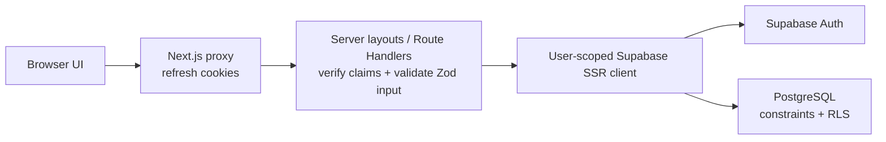

# Architecture

## Goals

TaskFlow is a server-first Next.js application for isolated, authenticated user workspaces. Its architecture keeps authorization close to the database, client state narrow, and feature boundaries explicit.

## Application boundaries

- `src/app`: routes, layouts, metadata, loading/error boundaries, and Route Handlers.
- `src/features`: domain-specific schemas, data access, hooks, and UI for authentication and tasks.
- `src/components`: reusable presentation primitives without domain knowledge.
- `src/lib`: infrastructure such as environment validation, Supabase clients, and shared API utilities.
- `src/providers`: the small client-provider boundary for TanStack Query, theme, and notifications.
- `src/types`: generated database types and shared public contracts.
- `supabase`: declarative migrations, local seed data, and database policy checks.

## Rendering and data flow

Server Components are the default. The authenticated dashboard layout verifies the session on the server. Its initial task and metrics queries are dehydrated into TanStack Query; interactive client components then own filters, forms, and mutations. Client requests use same-origin Route Handlers, which validate input and execute through an SSR Supabase client carrying the user's cookie session. PostgreSQL RLS is the final authorization boundary.

Authentication uses separate browser, server, and proxy Supabase clients. The root `proxy.ts` refreshes cookie sessions and provides early redirects; the protected dashboard layout and the reusable API guard independently verify signed claims. Forms use React Hook Form for accessible browser feedback and invoke server actions that repeat validation before calling Supabase Auth.

The task feature separates public schemas/contracts, a server-only service, and a server-only Supabase repository. Route Handlers authenticate before parsing bodies, validate URL/body input, and return normalized responses. Repository operations include explicit `user_id` predicates in addition to RLS. Public task objects omit ownership identifiers and map database snake-case fields to camel case.

## Security posture

Only the Supabase URL and publishable key are exposed to the browser. No service-role credential is required. Proxy-based session refresh improves navigation behavior but is never treated as the only authorization check. All data mutations are validated at the HTTP boundary and constrained by RLS.

## Scaling path

The initial beta uses Vercel Functions and Supabase's Data API. Pagination and indexed filters avoid unbounded reads. Commercial scaling should add rate limiting, application telemetry, audit events, custom SMTP, disaster-recovery exercises, and team/workspace authorization before collaborative features.
