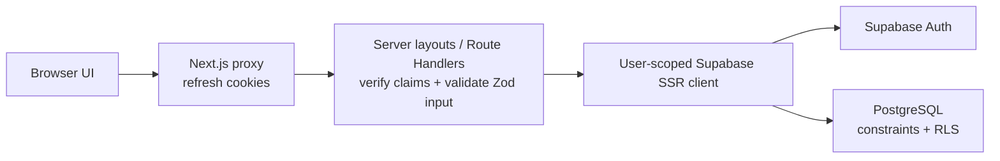

# Architecture

## Goals

TaskFlow is a server-first Next.js application for isolated, authenticated user workspaces. Its architecture keeps authorization close to the database, client state narrow, and feature boundaries explicit.

## Application boundaries

- `src/app`: marketing, authentication, and dashboard route groups; metadata routes; loading/error boundaries; and Route Handlers.
- `src/features`: domain-specific schemas, data access, hooks, and UI for authentication and tasks.
- `src/components`: reusable presentation primitives without domain knowledge.
- `src/lib`: infrastructure such as environment validation, Supabase clients, and shared API utilities.
- `src/providers`: route-scoped theme, TanStack Query, diagnostics, and notification boundaries.
- `src/types`: generated database types and shared public contracts.
- `supabase`: declarative migrations, local seed data, and database policy checks.

## Rendering and data flow

Server Components are the default. The authenticated dashboard layout verifies the session on the server and shares a request-cached auth context with the page. The URL-selected initial task query is dehydrated into TanStack Query; metrics are fetched client-side with the user's local calendar date so overdue boundaries remain correct. Interactive client components own filters, forms, and mutations. Client requests use same-origin Route Handlers, which validate input and pass one authenticated SSR Supabase client through the service and repository layers. PostgreSQL RLS is the final authorization boundary.

The seven public case-study routes are static Server Components. Their shared marketing layout provides crawlable navigation, a skip link, and a footer without mounting client providers. Public dark mode follows the browser color scheme in CSS. Dashboard-only providers mount theme persistence, TanStack Query, notifications, and development diagnostics after authorization.



Authentication uses separate browser, server, and proxy Supabase clients. The root `proxy.ts` refreshes cookie sessions and provides early redirects; the protected dashboard layout and the reusable API guard independently verify signed claims. Forms use React Hook Form for accessible browser feedback and invoke server actions that repeat validation before calling Supabase Auth.

The task feature separates public schemas/contracts, a server-only service, and a server-only Supabase repository. Route Handlers authenticate before parsing bodies, validate URL/body input, and return normalized responses. Repository operations include explicit `user_id` predicates in addition to RLS. Public task objects omit ownership identifiers and map database snake-case fields to camel case.

The dashboard Server Component authenticates and hydrates the URL-selected task query. Dashboard-only providers keep TanStack Query, notifications, and diagnostics out of public route bundles; heavy task dialogs load on demand. Client components use TanStack Query for background refresh, metrics, and mutations. Completion and deletion update matching list caches optimistically with rollback; authoritative lists and the single-query metrics RPC are revalidated afterward. Search, filters, sorting, and pagination live in the URL, while only temporary dialog/form state remains local.

Dashboard presentation uses neutral working surfaces with semantic accent, danger, and success tokens. Search is the primary task control; active filters are independently removable and pagination restores focus to the refreshed results heading. Motion is CSS-only, limited to short opacity/transform transitions, and disabled when reduced motion is requested. Radix owns dialog focus trapping/restoration while controlled close handlers protect dirty form input.

## Repository map

```text
src/app/             route groups, layouts, metadata, errors, API handlers
src/features/auth/   schemas, session checks, actions, and accessible forms
src/features/tasks/  contracts, repository/service, query hooks, and dashboard UI
src/components/      reusable presentation components
src/lib/             environment and Supabase infrastructure
supabase/             migrations, local seed, and transactional RLS checks
docs/                 architecture, API, security, database, testing, deployment
```

## Search and social discovery

`src/config/site.ts` is the single source for the canonical origin, public route list, navigation, repository URL, and page metadata helper. Metadata file conventions generate robots, sitemap, manifest, icons, and the social image. Structured data mirrors visible content: product entities appear on the homepage, the architecture route is a technical article, FAQ answers match the rendered disclosures, and nested pages include breadcrumbs. Authentication, dashboard, callback, and API routes are excluded from indexing.

## Security posture

Only the Supabase URL and publishable key are exposed to the browser. No service-role credential is required. Proxy-based session refresh improves navigation behavior but is never treated as the only authorization check. All data mutations are validated at the HTTP boundary and constrained by RLS.

## Scaling path

The initial beta uses Vercel Functions and Supabase's Data API. Pagination and indexed filters avoid unbounded reads. Commercial scaling should add rate limiting, application telemetry, audit events, custom SMTP, disaster-recovery exercises, and team/workspace authorization before collaborative features. Shared workspaces, roles, realtime collaboration, comments, and attachments are intentionally outside the beta boundary.
